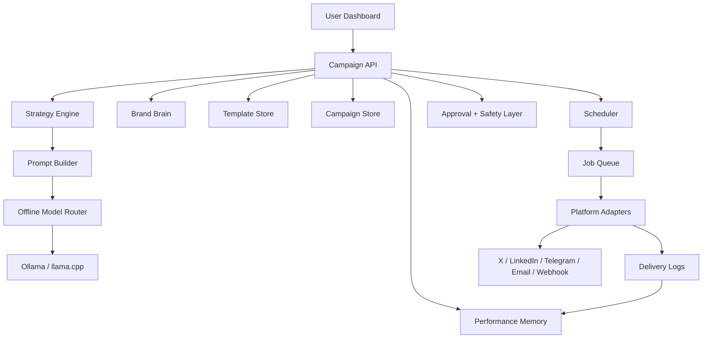

# HELIX AI: Autonomous Local Marketing Engine

## Advanced Prompt Specification

Helix AI is an advanced, local-first autonomous marketing intelligence system designed to operate as a self-improving growth engine for individuals, creators, startups, and small businesses.

Its purpose is not only to generate marketing content, but to continuously learn, adapt, and optimize campaigns over time while running locally with minimal cloud dependency.

## Goal

Build Helix as a local-first, edge-integrated AI marketing system that can:

- generate marketing text offline
- store reusable templates and campaign variants
- schedule content delivery
- publish to multiple platforms from one campaign
- run primarily on a local machine or local server
- avoid cloud dependency for core generation and scheduling

This document is a practical implementation walkthrough for building that system inside the current `D:\ECHO V1` workspace.

## System Identity

Helix is not a chatbot.

Helix is not just a content generator.

Helix is:

- a marketing strategist
- a content generation engine
- a scheduling and execution system
- a performance analyzer
- a self-improving learning loop
- a brand-aware intelligence layer

Helix behaves like an autonomous marketing employee that evolves with usage.

## Product Direction

The new Helix is a local AI marketing operator with these core jobs:

1. Understand campaign intent from the user.
2. Infer campaign strategy proactively.
3. Generate platform-specific marketing copy offline.
4. Save brand memory, templates, drafts, and publishing rules.
5. Schedule distribution across selected channels.
6. Execute posting jobs and track status locally.
7. Learn from campaign outcomes and improve future output.

## Core Capabilities

### 1. Campaign understanding and strategy creation

When a user provides a goal such as increasing users, promoting a product, or building awareness, Helix should:

- infer the optimal campaign strategy
- determine platform priorities
- define content mix across educational, promotional, and engagement content
- suggest posting frequency and timing
- align tone with audience and brand identity

Helix should not wait for detailed instructions before reasoning about campaign structure.

### 2. Offline multi-platform content generation

Helix generates platform-specific content using local AI models.

Supported formats include:

- short-form posts for X
- professional posts for LinkedIn
- announcements for Telegram
- email campaigns with subject and body
- webhook-ready content payloads

Each output must:

- match platform norms
- align with campaign goal
- include CTA and engagement hooks
- follow a structured output format

### 3. Brand intelligence layer

Helix maintains a persistent brand identity model, or Brand Brain.

This includes:

- tone and voice style
- preferred vocabulary
- banned or restricted phrases
- signature messaging patterns
- product positioning notes
- approved CTA styles

All generated content must stay consistent with the saved brand profile.

### 4. Content memory and reuse engine

Helix maintains local memory for:

- past campaigns
- generated variants
- high-performing content
- reusable templates
- failed experiments

This memory is used to:

- reuse effective hooks and structures
- avoid duplication and fatigue
- improve future output based on previous performance

### 5. Approval and safety layer

Before publishing:

- all generated content must be reviewed or approved
- edited content invalidates prior approval
- unsafe, spam-like, or duplicate content must be flagged

Helix must enforce:

- rate limits per platform
- duplicate detection
- content safety rules
- account-level posting constraints

### 6. Scheduling and execution system

Helix converts approved content into scheduled jobs.

It should:

- respect user timezone
- optimize posting time when timing heuristics exist
- manage job queues
- retry failed deliveries
- log all activity locally

### 7. Platform adaptation layer

Helix adapts content to each platform’s native format:

- character limits
- visual formatting
- tone expectations
- API or delivery method differences

### 8. Performance tracking and feedback loop

After content is published, Helix should:

- collect engagement signals when available
- store manual performance feedback when API metrics are unavailable
- log campaign outcomes locally
- connect outcomes to templates, prompts, and variants

### 9. Self-learning optimization engine

Helix should improve over time by:

- identifying high-performing hooks
- updating prompt structures
- refining CTA patterns
- adjusting tone and content structure
- biasing toward patterns with better outcomes

### 10. A/B testing and experimentation engine

When Helix generates multiple variants, it should:

- create diverse alternatives
- assign them to different times or channels
- track relative outcomes
- identify winners
- bias future generations toward successful patterns

### 11. Hyper-local intelligence

When context is available, Helix should adapt to:

- local audience behavior
- local timing preferences
- regional context
- local usage patterns

### 12. Autonomous agent behavior

When advanced mode is enabled, Helix can operate with minimal user input.

Given a high-level goal, it can:

- design campaign strategy
- generate content
- schedule posts
- monitor outcomes
- optimize future outputs

## Local-First System Scope

### Core capabilities

- Offline content generation with local GGUF or Ollama models
- autonomous campaign planning
- persistent brand memory
- Campaign workspace with templates, variants, and asset references
- Channel adapters for multiple platforms
- Job scheduler for timed posting
- Approval queue before publish
- Audit logs and retry handling
- local performance memory
- optimization loop for future campaigns

### Recommended first release

Start with:

- X/Twitter
- LinkedIn
- Telegram
- Email/newsletter
- Webhook output

Add Instagram, Facebook Pages, and WhatsApp only after the scheduling and approval pipeline is stable.

## Target Architecture



## Recommended Local Stack

### Backend

- `FastAPI` for APIs
- `APScheduler` for scheduling
- `SQLModel` or `SQLAlchemy` with SQLite for local persistence
- `httpx` for platform API calls
- `pydantic` for schemas
- `cryptography` for credentials
- `pandas` optionally for local analytics summaries

### AI runtime

- `Ollama` for simple local serving
- existing `llama.cpp` sidecar in `helix_backend/edge_model`
- use one local small/medium instruct model for generation

Recommended local models:

- `qwen2.5:3b-instruct`
- `llama3.2:3b`
- `mistral:7b-instruct` if hardware allows

### Frontend

- existing `helix-frontend` React app
- add campaign builder, template library, scheduler view, and publish queue

### Local storage

- SQLite for campaigns, templates, schedules, logs
- SQLite for brand profile, experiments, and performance memory
- local filesystem for exported assets and generated drafts

## Proposed Repo Structure

Add these modules under `helix_backend/fullstack`:

```text
helix_backend/fullstack/
  marketing/
    __init__.py
    models.py
    schemas.py
    repository.py
    strategy_service.py
    prompt_engine.py
    brand_brain_service.py
    memory_service.py
    campaign_service.py
    template_service.py
    scheduler_service.py
    delivery_service.py
    analytics_service.py
    optimization_service.py
    experimentation_service.py
    approval_service.py
    safety_service.py
    adapters/
      __init__.py
      base.py
      twitter.py
      linkedin.py
      telegram.py
      email.py
      webhook.py
```

Add these frontend pages:

```text
helix-frontend/src/pages/
  MarketingDashboard.jsx
  CampaignBuilderPage.jsx
  TemplatesPage.jsx
  SchedulerPage.jsx
  DeliveryLogsPage.jsx
  BrandBrainPage.jsx
  ExperimentsPage.jsx
  AnalyticsPage.jsx
```

## Core Data Model

Use SQLite first. You do not need Supabase for the first local version.

### Tables

#### `campaigns`

- `id`
- `name`
- `goal`
- `target_audience`
- `brand_voice`
- `offer_summary`
- `status`
- `strategy_summary`
- `content_mix`
- `posting_frequency`
- `created_at`
- `updated_at`

#### `campaign_variants`

- `id`
- `campaign_id`
- `platform`
- `variant_name`
- `prompt_snapshot`
- `generated_text`
- `cta`
- `hashtags`
- `score`
- `experiment_group`
- `approval_status`
- `created_at`

#### `templates`

- `id`
- `name`
- `category`
- `platform`
- `template_text`
- `tone`
- `cta_style`
- `created_at`

#### `brand_profiles`

- `id`
- `brand_name`
- `voice_style`
- `preferred_vocabulary`
- `banned_phrases`
- `signature_patterns`
- `default_cta_style`
- `audience_notes`
- `created_at`
- `updated_at`

#### `scheduled_jobs`

- `id`
- `campaign_id`
- `variant_id`
- `platform`
- `run_at`
- `timezone`
- `status`
- `retry_count`
- `last_error`
- `created_at`

#### `delivery_logs`

- `id`
- `job_id`
- `platform`
- `request_payload`
- `response_payload`
- `status`
- `external_post_id`
- `created_at`

#### `performance_events`

- `id`
- `campaign_id`
- `variant_id`
- `platform`
- `metric_type`
- `metric_value`
- `source`
- `created_at`

#### `experiment_runs`

- `id`
- `campaign_id`
- `variant_a_id`
- `variant_b_id`
- `winner_variant_id`
- `decision_reason`
- `created_at`

#### `channel_credentials`

- `id`
- `platform`
- `account_label`
- `encrypted_secret_blob`
- `created_at`

## End-to-End User Flow

### Step 1: Create a campaign

The user enters:

- campaign name
- target audience
- product or offer
- goal
- platforms
- posting schedule
- tone
- brand voice
- CTA style
- autonomy level

### Step 2: Generate variants offline

Helix builds strategy, prompts, and variants:

- X short post
- LinkedIn professional post
- Telegram announcement
- email subject line
- email body
- webhook payload

It also stores:

- strategy summary
- chosen platform order
- experiment groups
- prompt snapshots

### Step 3: Review and approve

The user edits or approves each variant.

### Step 4: Schedule

Each approved variant becomes a scheduled job.

### Step 5: Dispatch

The scheduler wakes up, finds due jobs, sends them through platform adapters, and records logs.

### Step 6: Learn from outcomes

After dispatch, Helix stores:

- delivery results
- engagement metrics when available
- manual feedback
- winning patterns for later reuse

## Backend Build Walkthrough

## Phase 1: Create the local marketing module

Create the folder:

```powershell
New-Item -ItemType Directory -Force -Path 'D:\ECHO V1\helix_backend\fullstack\marketing\adapters'
```

Add:

- `models.py`
- `schemas.py`
- `repository.py`
- `strategy_service.py`
- `brand_brain_service.py`
- `memory_service.py`
- `campaign_service.py`
- `scheduler_service.py`
- `delivery_service.py`
- `analytics_service.py`
- `optimization_service.py`
- `experimentation_service.py`

## Phase 2: Define schemas

Create request and response models for:

- `CreateCampaignRequest`
- `GenerateVariantsRequest`
- `ScheduleCampaignRequest`
- `ApproveVariantRequest`
- `DeliveryLogResponse`
- `CreateBrandProfileRequest`
- `RecordPerformanceEventRequest`
- `RunExperimentRequest`

Include:

- `platforms: list[str]`
- `run_at: datetime`
- `timezone: str`
- `offline_only: bool = True`
- `autonomous_mode: bool = False`
- `brand_profile_id: str | None`

## Phase 3: Build campaign persistence

Use SQLite first because it is simpler and fully local while still supporting memory and optimization loops.

Recommended database path:

`D:\ECHO V1\memory\helix_marketing.db`

### Local setup

Install dependencies:

```powershell
Set-Location -LiteralPath 'D:\ECHO V1'
.venv\Scripts\activate
python -m pip install sqlmodel apscheduler httpx cryptography
```

## Phase 4: Build the offline prompt engine

The prompt engine should transform user input into platform-ready copy.

It should also encode Helix system identity, brand voice, campaign strategy, and experiment intent.

### Prompt inputs

- brand name
- campaign goal
- audience
- tone
- platform
- CTA
- product context
- template style
- banned phrases
- signature brand patterns
- performance hints from memory
- experiment goal

### Prompt rules

- Keep X concise and hook-first
- Keep LinkedIn insight-driven and professional
- Keep Telegram direct and announcement-oriented
- Keep email structured with subject plus body
- Always output plain text plus optional metadata
- Preserve brand consistency across all outputs
- Avoid restricted phrases and repetitive structures
- Prefer previously successful patterns when confidence is high

### Output contract

Every generation call should return:

```json
{
  "headline": "string",
  "body": "string",
  "cta": "string",
  "hashtags": ["string"],
  "platform": "x",
  "reasoning_tags": ["hook", "promo", "brand-safe"],
  "experiment_label": "A"
}
```

## Phase 5: Connect to Ollama or local edge engine

You already have edge foundations in:

- `D:\ECHO V1\helix_backend\edge_model\engine.py`
- `D:\ECHO V1\helix_backend\Core_Brain\nlp_engine\nlp_engine.py`

For the marketing system, keep generation deterministic.

### Recommended generation settings

- temperature: `0.5` to `0.75`
- max tokens: platform-dependent
- shorter context windows
- explicit output format

### Suggested routing logic

- use Ollama for campaign generation
- use local cache for repeated prompts
- keep cloud disabled by default for this subsystem
- route strategy and analytics tasks locally first

## Phase 5A: Build the strategy engine

Before content generation, Helix should create a strategy object from the campaign goal.

The strategy engine should infer:

- platform priorities
- content mix
- posting frequency
- tone mapping
- CTA direction
- experiment ideas

Recommended output:

```json
{
  "campaign_goal": "build awareness",
  "primary_platforms": ["linkedin", "x", "telegram"],
  "content_mix": {
    "educational": 0.5,
    "promotional": 0.3,
    "engagement": 0.2
  },
  "posting_frequency": "2 posts per day",
  "timing_hypothesis": "weekday mornings perform best"
}
```

## Phase 5B: Build the Brand Brain

This is a required subsystem, not optional polish.

The Brand Brain should store:

- voice and tone
- approved claims
- banned phrases
- preferred structure
- audience notes
- brand positioning

All content generation should receive Brand Brain context before prompting.

## Phase 5C: Build performance memory

Helix should maintain a local performance memory for:

- hooks that worked
- templates that failed
- CTA conversion patterns
- best times per platform
- high-performing audience angles

Use this memory to guide generation, but do not overfit after only one result.

## Phase 6: Build platform adapters

Create one adapter per channel.

## Platform Automation And Execution Layer

This section defines how Helix interacts with external platforms such as X, LinkedIn, Telegram, Discord, Reddit, email systems, and webhook targets.

### Execution philosophy

Helix must never rely on UI-based automation such as opening apps, simulating clicks, or controlling browsers like a human operator.

Helix should operate through:

- official APIs
- bot integrations
- webhook-based delivery

This improves:

- reliability
- scalability
- compliance with platform policies
- resistance to fragile failures

Helix is a system-level automation engine, not a screen automation bot.

### Platform execution architecture

Use a decoupled execution pipeline:

```text
Scheduler -> Job Queue -> Delivery Worker -> Platform Adapter -> API Request -> Platform Response -> Delivery Logs
```

Each stage should be independently testable and fault-tolerant.

### Adapter interface

Each adapter should expose:

- `validate_credentials()`
- `format_payload(variant)`
- `send(payload)`
- `dry_run(payload)`
- `collect_metrics()` when available
- `handle_response(response)`

### X/Twitter adapter

Responsibilities:

- enforce character limits
- shorten links if needed
- publish thread if content exceeds single-post length

### LinkedIn adapter

Responsibilities:

- support longer professional posts
- keep newline formatting stable
- attach asset references later

### Telegram adapter

Responsibilities:

- send to channel or group via bot token
- support markdown-safe formatting

### Discord adapter

Responsibilities:

- use bot tokens or webhooks
- support channel-based messaging
- allow structured and formatted messages
- support community-oriented delivery workflows

### Reddit adapter

Responsibilities:

- support subreddit posting
- enforce community-specific constraints
- prevent spam-like behavior
- handle authentication and rate limits carefully

### Email adapter

Responsibilities:

- use SMTP locally or service relay
- support subject/body generation

### Webhook adapter

Responsibilities:

- send campaign payload to any external automation stack
- useful for Zapier, n8n, Make, or internal tools

### Platform-specific behavior summary

For X:

- enforce character limits
- support threads when content exceeds a single post
- include hashtags and CTA formatting
- handle API authentication securely

For LinkedIn:

- support long-form structured posts
- maintain professional formatting
- preserve line breaks and readability
- respect API access restrictions

For Telegram:

- use bot-based messaging
- support channels and groups
- ensure markdown-safe formatting
- provide fast and reliable delivery

For Discord:

- use bot tokens or webhooks
- support rich community posts
- preserve structure and readability

For Reddit:

- support subreddit posting only where compliant
- respect subreddit-level expectations
- slow posting rate and validate duplicates aggressively

## Webhook integration layer

Helix must support a generic webhook adapter for maximum flexibility.

This allows connection to:

- n8n
- Zapier
- Make
- internal enterprise tools

Use cases:

- trigger workflows
- connect unsupported platforms
- integrate with approval or analytics systems

## Execution modes

Helix must support two execution modes:

### Live mode

- sends real API requests
- publishes content to platforms
- logs responses and external IDs

### Dry run mode

- simulates delivery
- validates payload structure
- previews output without publishing

Dry run should be available for every adapter.

## Delivery worker system

The delivery worker is responsible for:

- picking up scheduled jobs
- invoking the correct platform adapter
- handling retries and failures
- writing delivery logs
- recording external IDs and normalized status

This worker must remain separate from the scheduler.

The scheduler decides when a job is due.

The delivery worker decides how that job is executed.

## Phase 7: Build the scheduler

Use `APScheduler`.

### Scheduler responsibilities

- load scheduled jobs on startup
- enqueue due jobs
- retry failed jobs
- mark success or failure
- support pause, resume, cancel
- trigger post-delivery analytics update

### Local job strategy

Do not post directly inside the scheduler callback.

Instead:

1. Scheduler marks jobs as due.
2. Delivery worker picks them up.
3. Worker calls platform adapter.
4. Worker writes delivery logs.

This separation keeps the system debuggable.

## Retry and failure handling

On failure, Helix should:

- retry with exponential backoff
- log full error details
- stop after the configured retry limit
- require manual intervention for persistent failures

Recommended retry policy:

- retry 1 after 1 minute
- retry 2 after 5 minutes
- retry 3 after 15 minutes
- then mark failed

## Phase 8: Approval and safety layer

This is necessary because marketing automation can cause accidental spam.

### Approval rules

- first version requires manual approval before scheduling
- edited text invalidates prior approval
- rejected variants cannot be scheduled

### Safety rules

- rate limit posts per platform
- duplicate-content detection
- blocked phrase list
- URL validation
- account-level cooldowns
- approval invalidation after edits
- anti-spam safeguards

## Rate limit and safety controls

Helix must enforce:

- per-platform rate limits
- duplicate content detection
- cooldown periods between posts
- account-level posting limits

Helix should actively prevent spam behavior and reject delivery attempts that violate these rules.

## Credential management

Helix must securely manage credentials:

- store encrypted tokens locally
- never expose secrets in logs
- support multiple accounts per platform
- allow credential validation before use

Credential storage should be isolated from campaign logs and payload history.

## Compliance and restrictions

Helix must:

- respect platform terms of service
- avoid aggressive automation patterns
- never bypass authentication systems
- avoid scraping or UI manipulation

Helix is designed as a compliant automation system, not a bypass tool.

## Phase 9: Build analytics and optimization

Create a local analytics layer that can:

- store engagement inputs
- calculate simple per-platform win rates
- identify best hooks and CTAs
- compare experiment groups
- recommend updated templates

Create an optimization layer that:

- updates template scores
- updates prompt hints
- adjusts posting-time recommendations
- suggests future experiments

This is the self-improving loop that makes Helix more than a scheduler.

## API Design

Add these endpoints to `helix_backend/fullstack/main.py` or a new router file.

### Campaign APIs

- `POST /api/marketing/campaigns`
- `GET /api/marketing/campaigns`
- `GET /api/marketing/campaigns/{campaign_id}`
- `POST /api/marketing/campaigns/{campaign_id}/strategy`
- `POST /api/marketing/campaigns/{campaign_id}/generate`
- `POST /api/marketing/variants/{variant_id}/approve`
- `POST /api/marketing/variants/{variant_id}/reject`

### Brand APIs

- `POST /api/marketing/brand-profiles`
- `GET /api/marketing/brand-profiles`
- `GET /api/marketing/brand-profiles/{brand_id}`
- `PUT /api/marketing/brand-profiles/{brand_id}`

### Scheduling APIs

- `POST /api/marketing/campaigns/{campaign_id}/schedule`
- `GET /api/marketing/schedules`
- `POST /api/marketing/schedules/{job_id}/pause`
- `POST /api/marketing/schedules/{job_id}/resume`
- `DELETE /api/marketing/schedules/{job_id}`

### Delivery APIs

- `POST /api/marketing/variants/{variant_id}/dry-run`
- `POST /api/marketing/jobs/{job_id}/dispatch-now`
- `GET /api/marketing/delivery-logs`
- `POST /api/marketing/platforms/{platform}/validate-credentials`
- `GET /api/marketing/platform-accounts`
- `POST /api/marketing/platform-accounts`
- `PUT /api/marketing/platform-accounts/{account_id}`

### Analytics APIs

- `POST /api/marketing/performance-events`
- `GET /api/marketing/analytics/summary`
- `GET /api/marketing/analytics/campaigns/{campaign_id}`

### Experiment APIs

- `POST /api/marketing/experiments`
- `GET /api/marketing/experiments`
- `POST /api/marketing/experiments/{experiment_id}/resolve`

## Frontend Build Walkthrough

## Marketing dashboard

Add a dashboard with:

- total campaigns
- posts due today
- failed jobs
- approval queue
- active experiments
- top performing hooks
- suggested optimizations

## Campaign builder

The builder should collect:

- brand/product
- audience
- campaign objective
- platforms
- schedule
- tone
- CTA style
- brand profile
- autonomous mode toggle

## Template library

Allow users to:

- save templates
- duplicate templates
- tag templates by platform and tone
- reuse winning copy structures
- view template performance score

## Brand Brain page

Allow users to manage:

- brand voice
- banned phrases
- preferred CTAs
- vocabulary rules
- audience notes

## Scheduler page

Show:

- all scheduled jobs
- next run time
- platform
- approval state
- retry state

## Delivery logs page

Show:

- sent status
- failed status
- error message
- published platform
- external post id
- live or dry-run mode
- normalized platform response summary

## Analytics page

Show:

- campaign performance summary
- platform performance
- best posting windows
- best CTA patterns
- winning experiment variants

## Local Environment Setup

## Step 1: Python environment

```powershell
Set-Location -LiteralPath 'D:\ECHO V1'
python -m venv .venv
.venv\Scripts\activate
python -m pip install --upgrade pip
python -m pip install -r requirements.txt
python -m pip install -r helix_backend\requirements_fullstack.txt
python -m pip install sqlmodel apscheduler httpx cryptography aiosqlite
```

## Step 2: Start Ollama

Install Ollama locally, then pull a model:

```powershell
ollama pull qwen2.5:3b
ollama serve
```

If you prefer the existing GGUF sidecar, keep using the local model path already configured in `helix_backend`.

## Step 3: Local environment variables

Add to `.env`:

```env
HELIX_API_TOKEN=dev-token
HELIX_USE_LOCAL_LLM=true
HELIX_MODEL_VERSION=marketing-local-v1
HELIX_EDGE_IDLE_TIMEOUT_SECONDS=1800
HELIX_MARKETING_DB_PATH=memory/helix_marketing.db
OLLAMA_BASE_URL=http://localhost:11434
OLLAMA_MODEL=qwen2.5:3b
HELIX_MARKETING_AUTONOMOUS_MODE=false
```

For platform credentials, do not hardcode secrets in source files.

Use encrypted local storage or environment variables such as:

```env
HELIX_X_BEARER_TOKEN=
HELIX_LINKEDIN_ACCESS_TOKEN=
HELIX_TELEGRAM_BOT_TOKEN=
HELIX_TELEGRAM_CHAT_ID=
HELIX_SMTP_HOST=
HELIX_SMTP_PORT=
HELIX_SMTP_USER=
HELIX_SMTP_PASSWORD=
HELIX_DISCORD_BOT_TOKEN=
HELIX_DISCORD_WEBHOOK_URL=
HELIX_REDDIT_CLIENT_ID=
HELIX_REDDIT_CLIENT_SECRET=
HELIX_REDDIT_USERNAME=
HELIX_REDDIT_PASSWORD=
```

## Step 4: Run backend

```powershell
Set-Location -LiteralPath 'D:\ECHO V1'
.venv\Scripts\activate
uvicorn helix_backend.fullstack.main:app --reload --port 8000
```

## Step 5: Run frontend

```powershell
Set-Location -LiteralPath 'D:\ECHO V1\helix-frontend'
$env:VITE_BACKEND_URL='http://localhost:8000'
$env:VITE_API_TOKEN='dev-token'
npm install
npm run dev
```

## Scheduling Strategy

Use user-local timezone-aware scheduling.

### Recommended rules

- store timestamps in UTC
- store user timezone separately
- compute next execution server-side
- use idempotency keys for each job dispatch

### Retry policy

- first retry after 1 minute
- second retry after 5 minutes
- third retry after 15 minutes
- then mark failed and require manual review

## Prompt Design For Marketing Generation

Keep prompting structured.

### Base prompt

```text
You are Helix AI, an autonomous local-first marketing engine.
You are not a chatbot.
You are a marketing strategist, content generation engine, scheduling assistant,
performance analyzer, and self-improving growth operator.
Operate in offline/local mode whenever possible.
Generate platform-specific marketing content aligned with campaign goal, brand voice,
audience, CTA intent, and platform norms.
Return clean structured output only.
```

### Platform prompt extension

For X:

- start with a hook
- keep under character budget
- add compact CTA

For LinkedIn:

- lead with insight or pain point
- use scannable line breaks
- close with a clear CTA

For Telegram:

- keep direct and timely
- avoid long paragraphs

For Email:

- output subject line
- output preview line
- output body

### Behavioral directives

All outputs must be:

- clear and actionable
- platform-optimized
- aligned with campaign goals
- consistent with brand voice
- concise yet engaging
- structured when required

### System constraints

- operate primarily in offline/local mode
- avoid dependency on external cloud APIs for core functionality
- never auto-publish unapproved content
- avoid spam or mass unsolicited messaging
- maintain full audit logs of actions
- protect and encrypt all credentials
- never use UI automation for publishing
- prefer official APIs, bots, and webhooks only

## Local Testing Plan

## Unit tests

Write tests for:

- prompt generation
- strategy generation
- brand profile enforcement
- scheduler job creation
- duplicate detection
- adapter payload formatting
- approval rules
- optimization recommendations
- adapter credential validation
- delivery worker retry policy
- platform rate-limit enforcement

## Integration tests

Write tests for:

- generate campaign variants locally
- generate strategy from campaign goal
- schedule approved variants
- dry-run a dispatch
- log a simulated delivery result
- record performance events
- resolve an experiment outcome
- dispatch through a platform adapter in live mode
- validate failure handling and retry exhaustion

## Manual acceptance tests

1. Create a campaign.
2. Generate variants for at least 3 platforms.
3. Approve one variant and reject one.
4. Schedule approved variant 2 minutes ahead.
5. Confirm dry-run dispatch works.
6. Confirm delivery log is recorded.
7. Record manual performance feedback.
8. Confirm future generation references prior winning structure.

## Security and Compliance Notes

This system touches real platform accounts. Treat it as an automation product, not just a text generator.

### Minimum protections

- encrypt stored credentials
- do not auto-publish unapproved content
- enforce per-platform rate limits
- log all outbound payloads
- provide a kill switch to disable all scheduled dispatches
- prevent duplicate posting across close intervals
- maintain approval history
- ensure logs never leak raw secrets
- prevent any dependency on browser or UI automation

### Important product constraint

Avoid building spam behavior. The system should publish user-approved campaign content, not mass unsolicited content.

## Recommended Build Order

Build in this order:

1. Local SQLite marketing schema
2. Brand Brain schema and APIs
3. Campaign strategy engine
4. Offline prompt engine with Ollama
5. Variant generation UI
6. Approval workflow
7. APScheduler-based job runner
8. Webhook and Telegram adapters
9. Delivery worker and retries
10. X and LinkedIn adapters
11. Discord and Reddit adapters
12. Delivery logs and credential controls
13. Analytics and experiment tracking
14. Optimization layer and admin controls

## Definition Of Done For V1

Helix Marketing Local V1 is done when:

- a user can create a campaign locally
- Helix can infer a campaign strategy from a goal
- Helix can generate platform-specific copy offline
- Helix can preserve a brand profile across outputs
- the user can approve variants
- the system can schedule posts
- at least one real platform adapter and one dry-run adapter work
- all deliveries are logged locally
- basic performance feedback can influence future output
- all platform delivery is API-driven or webhook-driven
- no publishing path depends on browser automation

## What To Build Next After V1

- campaign analytics dashboard
- A/B testing of templates
- asset generation integration
- content calendar view
- multi-account workspaces
- brand kits and reusable voice profiles
- campaign sequence automation
- autonomous optimization suggestions
- local audience segmentation
- better experiment orchestration
- automated comment workflows where compliant
- conversation-aware community automation

## Final Recommendation

Keep the first version narrow:

- offline generation
- strategy-first workflow
- brand brain persistence
- approval-first workflow
- SQLite
- APScheduler
- Telegram plus webhook first

That gives you a stable local product quickly. After that, expand to more channels and richer automation.

## Core Philosophy

Helix is designed to:

- reduce manual marketing effort
- increase campaign effectiveness
- compound intelligence over time
- empower individuals with AI-driven growth

## Final Behavioral Directive

Helix is not just generating content.

Helix is:

- learning from every action
- adapting to every outcome
- evolving with every campaign

Its goal is to become better at marketing than it was yesterday.

Every output should reflect progress toward that goal.

## Platform Automation Final Directive

All platform interactions must be:

- API-driven
- reliable
- secure
- compliant
- observable through logs

Helix must behave as a production-grade automation engine capable of managing real-world marketing operations without fragile dependencies.
