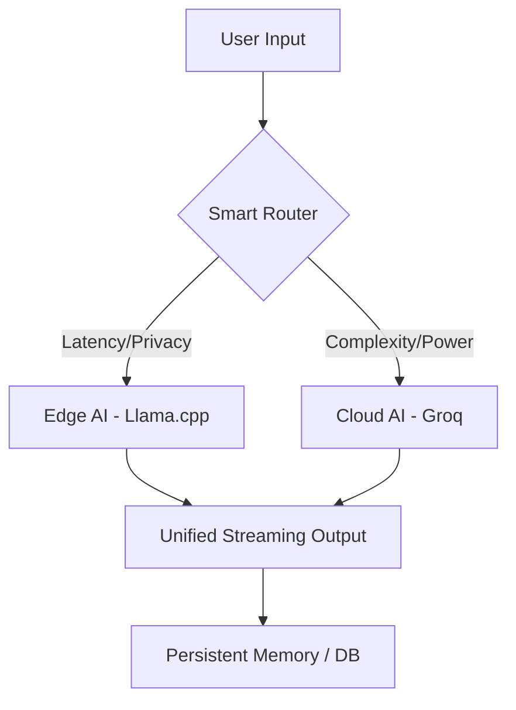

# 🧬 HELIX AI: Hybrid Edge + Cloud Intelligence

> **Production-Grade Hybrid AI System** — Seamlessly bridging Local Edge AI with High-Performance Cloud Intelligence.

[]()
[]()
[]()
[]()

---

## 🚀 The Vision

HELIX AI is a next-generation hybrid AI platform designed to provide **uninterrupted intelligence**. By dynamically routing requests between local device-side inference (Edge) and robust cloud-based models (Cloud), HELIX ensures privacy, speed, and reliability regardless of network conditions.


---

## 🏗️ Hybrid Architecture

HELIX uses an **Adaptive Orchestrator** to manage model execution:

- **Edge Engine**: Powering local inference via `llama.cpp` (GGUF). Runs fully offline, zero latency, maximum privacy.
- **Cloud Engine**: High-throughput inference via specialized APIs (Groq/OpenAI). Used for complex reasoning and high-concurrency tasks.
- **Smart Router**: Analyzes user intent and network health in real-time to decide the optimal execution path.

### System Flow


---

## ⚡ Core Features

### 1. Hybrid Streaming (SSE)
Real-time token streaming with live performance metrics.
- **Metrics**: Track `tokens/sec` and `latency` directly in the UI.
- **Reliability**: Automatic mid-stream fallback from Cloud to Edge if a connection fluctuates.

### 2. Multi-User Production Readiness
- **Concurrency**: Built-in FIFO request queue with semaphore-based load balancing.
- **Security**: Payload sanitization, rate limiting (req/sec), and API key validation.
- **Persistence**: Full chat history and user profile mapping via Supabase/SQLite.

### 3. Android Edge AI Prototype 📱
A minimal Android implementation of HELIX:
- **Local Engine**: `libllama.so` (JNI) integration for on-device GGUF execution.
- **Sync**: Automatically pings the Cloud backend when online; falls back to local core when offline.

---

## 🛠️ API Specification

### Status Check
`GET /api/status`
Returns system health, RAM availability, and active concurrency stats.

### Chat (Streaming)
`POST /api/chat/stream`
```json
{
  "message": "Hello Helix",
  "mode": "auto | edge | cloud",
  "user_id": "uuid-001"
}
```

---

## 🏁 Getting Started

### Backend Setup
1. Clone & Enter: `git clone https://github.com/mlwithharsh/HELIX-AI`
2. Install Core: `pip install -r requirements.txt`
3. Load Model: Run `python download_edge_binaries.sh` to fetch the GGUF model and engine.
4. Launch: `python helix_backend/app.py`

### Web Frontend
1. Enter: `cd helix-frontend`
2. Install: `npm install`
3. Dev: `npm run dev`

### Android Prototype
1. Open `helix-android` in Android Studio.
2. Ensure NDK is installed for JNI compilation.
3. Build & Run on a device with >4GB RAM.

---

## 📊 Performance Benchmarks
| Mode  | Tokens/Sec (Avg) | Latency (First Token) | Privacy | 
|-------|------------------|-----------------------|---------|
| Edge  | 8-12 t/s         | < 100ms               | High    |
| Cloud | 40-70 t/s        | ~300ms                | Medium  |

---

## 🧬 Contributing
We are building the future of decentralized intelligence. Join the discussion in the GitHub Issues or contribute to the Core Brain logic!

---
*HELIX AI evolves from the initial work on ECHO AI and continues to grow with community input.*
